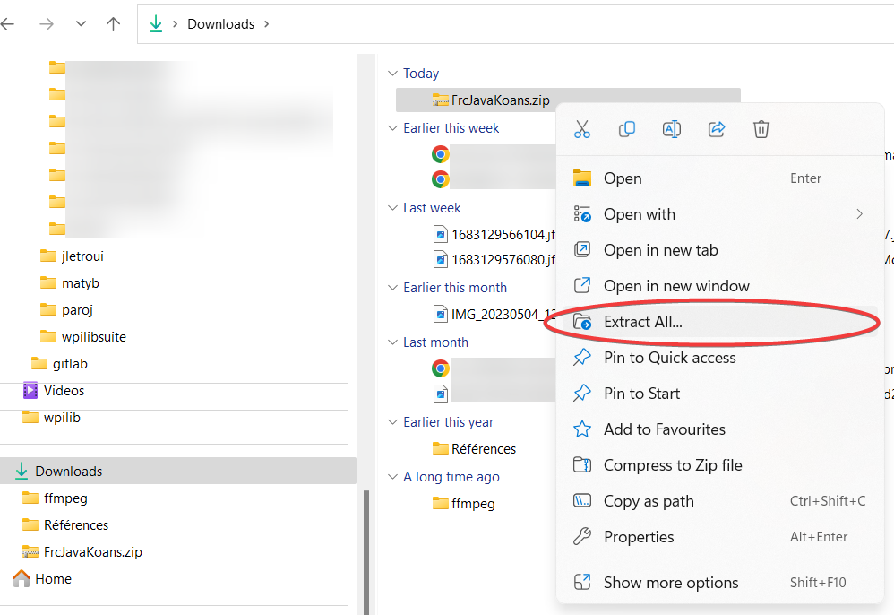
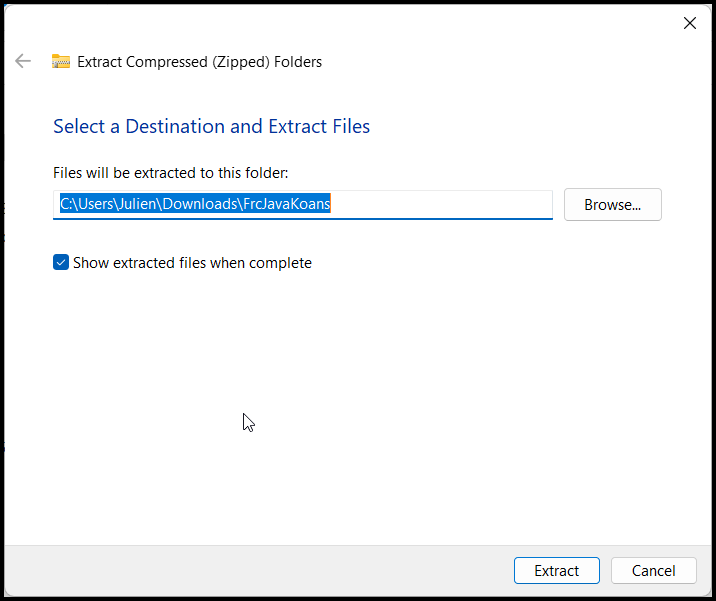
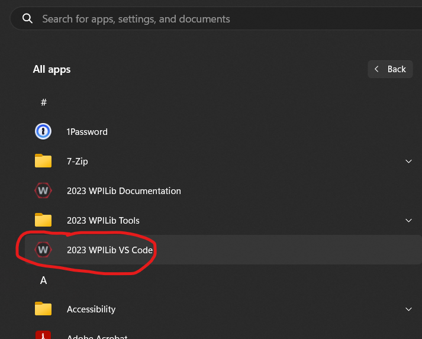
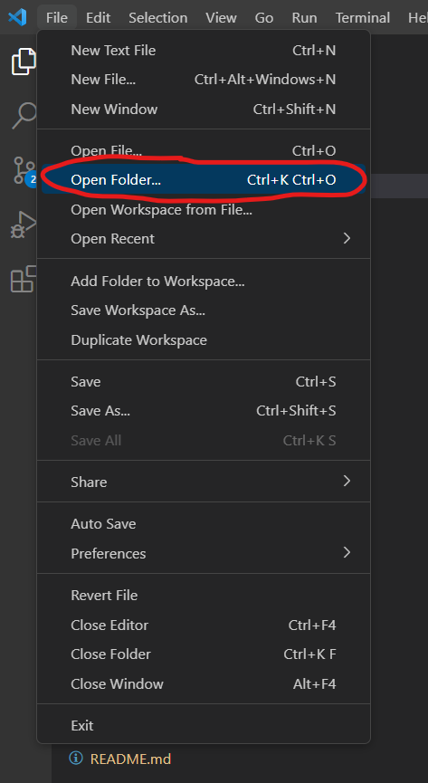
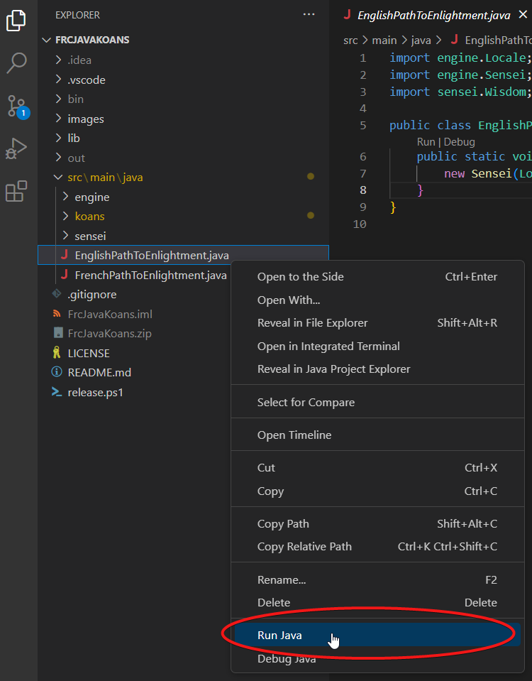

# Java Koans for the FRC

Java Koans for the [FRC](https://www.firstinspires.org/robotics/frc) is an interactive, step by step, course to teach Java to students engaged in the First Robotics Competition. It requires no previous experience in programming. It does not intend to teach the entirety of the Java language, but rather most of the fundamentals required to start programming a FRC robot.

## Getting Started

You will need to install [WPILib](https://docs.wpilib.org/en/stable/docs/zero-to-robot/step-2/wpilib-setup.html) first to run the Java Koans for the FRC.

Once installed, you are ready to get and run the koans.

Download the [latest release](https://github.com/jletroui/FrcJavaKoans/releases/download/v0.2/FrcJavaKoans.zip).

Then extract it somewhere on your computer. For example, in a `/src` folder within your Documents folder.




Then, open WPILib VSCode:



And open the folder in which you extracted the koans (for example, `C:\Users\Jane\Documents\src\FrcJavaKoans`):



You are ready to go!

## Learning to code with the Java Koans for the FRC

### Run the koans

When you open the Java Koans for the FRC in VS Code, you should see something similar to this:


Expand the `src` folder, then right click on the file `src\main\java\PathToEnlightment.java` and choose `Run Java`:



This will open what is called a 'terminal' at the bottom of the VS Code window and run the Java Koans for the FRC. Ignore all the cryptic text generated by VS Code for know and focus on this part:

```
Thinking AboutConsoleAndVariables ...
AboutConsoleAndVariables.sayHelloInConsole has damaged your karma.

The master says:
  You have not yet reached enlightment ...

Console:
---------


---------

Expected to see 'Hello!' in the console, but read nothing instead

Please meditate on sayHelloInConsole in src/main/java/koans/AboutConsoleAndVariables.java
```

The Koans are telling you a lot, so let's decompose a bit.

First, it tells you that it is trying to teach you  `AboutConsoleAndVariables`. Then it tells you that the specific `AboutConsoleAndVariables.sayHelloInConsole` exercise was not successful. Which is normal, because, you know, you have not even started yet! Then it shows a mysterious `Console` box, which we will ignore for now. At the very bottom, it tells you you can look for `sayHelloInConsole` in the `src/main/java/koans/AboutConsoleAndVariables.java` file.

### Opening the exercise file

Open that file in VS Code:


Wow, there is a lot going on! In order to understand what is all of this, we need to learn about a few things about Java.

### Java files

All the code written in Java must go in files with the `.java` extension. These files follow a pretty strict organisation. First at the top, there are a few lines helping Java knowing which other files it will need to get in order to make sense of this one:

```java
package koans;

import static engine.Helpers.readLine;
```

We will not explain the details of these lines for now and ignore it.

### The class

Next in the file, we can see this:

```java
public class AboutConsoleAndVariables {
```

This tells Java that we are creating a `AboutConsoleAndVariables` class. All the code of the class is contained between the opening '{' and the closing '}' at the bottom of the file. All the bits of code in Java are organised in classes. You can think of a class like a drawer or a shelf containing bits of code. You can only have one class in a java file, and the name of the file must be the name of the class, with the `.java` extension. This is why the file we are looking at is named `AboutConsoleAndVariables.java`.

Note: everywhere in Java where you will need to 'enclose' a bit of code, we will use an opening '{' and a closing '}'. This will tell Java that everything between those curly brackets are belonging to the same thing.

### The exercise comment

Next, we can see these lines, colored in green:

```java
    /**
     * Display 'Hello!' in the console.
     * 
     * ---------   TIPS --------------
     * 
     * All lines of code in Java must end with the ';' character. Ex:
     * 
     * System.out.println("Apple");
     * 
     * You can use the method System.out.println([some value]) to write something in the console.
     * 
     * You can tell Java that some value is text by enclosing it between double quotes. Ex:
     * 
     * "This is text"
     * 
     * -------------------------------
     * 
     * Expected result in the console:
     * 
     * Hello!
     */
```

These lines are forming what's called a 'comment'. A comment is a piece of information that is ignored by Java. It is not code. It is very useful for documenting your code while you are writing Java. In this case, the Java FRC Koans are using comments for describing what is the exercise. First, it is telling you the goal of the exercise: `Display 'Hello!' in the console.`. The console is the simplest way for a Java program to communicate with you by displaying simple text in a terminal. Remember what was displayed when running the Koan? You saw this bit:

```
Console:
---------


---------
```

This is where the text will appear when you will code something to display in console.

After the goal of the exercise, the comment goes on with tips on how to solve the exercise. For example, it is telling you to use `System.out.println([some value])`. Note: when you see square brackets '['  and ']' in the exercise, it is not something to type in directly, but rather it is a placeholder for you to type something else.

Finally, the last section of the comment is showing you what the result of your code for the exercise should produce.

When trying to solve a koan exercise, take your time to understand all the information that is given to you to successfully solve the exercise.

### The exercise method

Finally, we arrive at the part of the file where you will be able to code in Java! In Java all the code must be part of a 'program chunk' called a method. A method is really nothing else than a mini-program. Here is the method of the first koan:

```java
    public static void sayHelloInConsole() {

    }
```

We will ignore the `public static void` part for now. What comes next is the name of the method: `sayHelloInConsole`. All the code chunks in Java have names, allowing to refer to it later, if we want to run that piece of code. Then comes parentheses: `()`. This is basically telling Java that `sayHelloInConsole` is a method. And at last, the opening '{' and closing '}'. All the code you will write will have to go in between those 2 curly brackets, and nowhere else. If you write code outside of the curly brackets of a method, Java will show you an error.

So let's try so solve this exercise. To do it, we have to display 'Hello!' in the console. The first tip for doing so is:

```
     * All lines of code in Java must end with the ';' character.
```

Ok, so we can at least put a ';' at the end of our line, so we don't forget:

```java
    public static void sayHelloInConsole() {
        ;
    }
```

The next piece of tip is:

```
     * You can use the method System.out.println([some value]) to write something in the console.
```

So we know we should use this command, and find a way to replace '[some value]' by the 'Hello!' text later. Let's write down the command without the value for now:

```java
    public static void sayHelloInConsole() {
        System.out.println();
    }
```

Next the final tip is telling us how to write a text value:

```
     * You can tell Java that some value is text by enclosing it between double quotes.
```

Perfect! So let's place the value within the previous command:

```java
    public static void sayHelloInConsole() {
        System.out.println("Hello");
    }
```

### Running the koans again

Now that we think we completed the exercise, let's run the koans again and see what happens. To run the koans, right-click on `PathToEnlightment.java` and choose `Run Java`. Here is the result:

```
Thinking AboutConsoleAndVariables ...
AboutConsoleAndVariables.sayHelloInConsole has damaged your karma.

The master says:
  You have not yet reached enlightment ...

Console:
---------

Hello

---------

Expected to see 'Hello!' in the console, but read 'Hello' instead

Please meditate on sayHelloInConsole in src/main/java/koans/AboutConsoleAndVariables.java
```

Oops, we made a mistake! The master was expecting us to display 'Hello!', but we displayed 'Hello' without the exclamation mark. Let's fix it in `src/main/java/koans/AboutConsoleAndVariables.java`:

```java
    public static void sayHelloInConsole() {
        System.out.println("Hello!");
    }
```

And run the koans again:

```
Thinking AboutConsoleAndVariables ...
AboutConsoleAndVariables.computeTwoAndTwo has damaged your karma.

The master says:
  You have not yet reached enlightment ...

Console:
---------


---------

Expected to see '4' in the console, but read nothing instead

Please meditate on computeTwoAndTwo in src/main/java/koans/AboutConsoleAndVariables.java
```

That's a completely different message! This is because we successfully completed the first exercise, so the master is telling us about the next exercise.

Congratulations! You can now look at the next comment and method in the `src/main/java/koans/AboutConsoleAndVariables.java` and try to figure out how to complete the next exercise!

## Mentors

Not all teams have access to a mentor with programming knowledge. This course intent to come batteries included, with 100% of the information needed by a motivated student to learn Java from Scratch without any other ressource at hand.

That being said, this is a lot of reading for most kids. Knowledgeable mentors can enhance this course by providing students guidance, especially for the content of this README. As for the exercises themselves, mentors are encouraged to not give solutions to students' issues, and instead ask them open questions about what they don't understand about the exercices text. Programming is, most of the time, about figuring out what little detail have been overlooked. Thus, helping students to look for answers by themselves in the exercises' text will help them become more autonomous when it will be time to program and debug a robot. That being said, any improvement to the clarity and conciseness of the textual material of this course would be highly appreciated and pull requests are very welcomed!

## Credits

Heavily inspired by the wonderful [Ruby Koans](https://www.rubykoans.com/).
